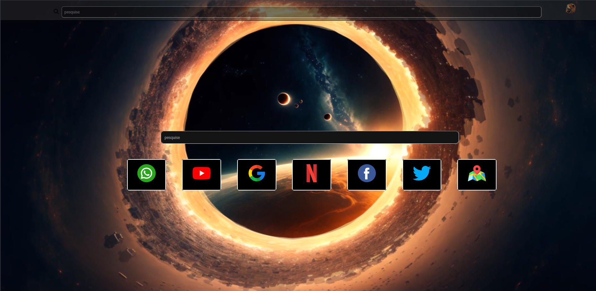

🌐 README — Projeto: Tela de Pesquisa Web (HTML + CSS)

# 🌐 Tela de Pesquisa Web

Projeto front-end criado para praticar estruturação com HTML e estilização com CSS. A página simula uma interface de pesquisa com ícones de acesso rápido, fundo personalizado e layout moderno.

---

## 🚀 Tecnologias usadas

- HTML5
- CSS3
- Editor de código: VS Code

---

## 📸 Exemplo da interface



---

## 🔧 Como usar

1. Clone o repositório:
   ```bash
   git clone https://github.com/Abimael-bak/Tela-Pesquisa-Web.git

    Abra a pasta do projeto no seu editor de código

    Clique duas vezes no arquivo index.html ou abra-o no navegador

🧠 Conceitos praticados

    Estrutura básica de páginas HTML

    Estilização com CSS

    Posicionamento e alinhamento de elementos

    Uso de imagens e ícones

    Interface intuitiva

✍️ Autor

Abimael de Jesus Abreu
LinkedIn
GitHub


